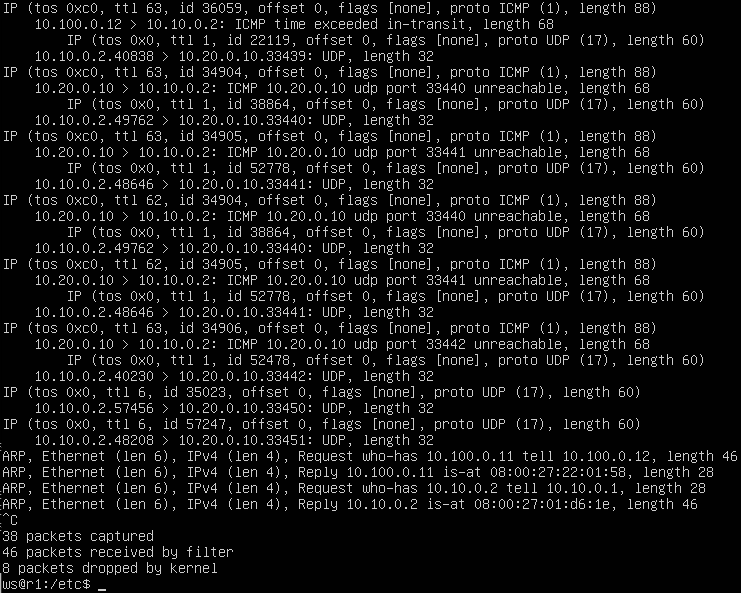

# Part 1. Инструмент ipcalc 
## 1.1. Сети и маски

1. Адрес сети 192.167.38.54/13

2. Перевод маски 255.255.255.0 в префиксную и двоичную запись, /15 в обычную и двоичную, 11111111.11111111.11111111.11110000 в обычную и префиксную

3. Минимальный и максимальный хост в сети 12.167.38.4 при масках: /8, 11111111.11111111.00000000.00000000, 255.255.254.0 и /4

## 1.2 localhost

localhost (так называемый, «местный» от англ. local, или «локальный хост», по смыслу — этот компьютер) — в компьютерных сетях, стандартное, официально зарезервированное доменное имя для частных IP-адресов (в диапазоне 127.0.0.1 — 127.255.255.254, RFC 2606).

IP: 194.34.23.100 не является localhot
IP: 127.0.0.2, 127.1.0.1, 128.0.0.1 - можно ли обратиться к приложению

## 1.3. Диапазоны и сегменты сетей

Существуют классификации IP-адресов как «частные» и «публичные». Следующие диапазоны адресов зарезервированы для частных (также известных как LAN) сетей:

10.0.0.0 — 10.255.255.255 ( 10.0.0.0/8 ),

172.16.0.0 — 172.31.255.255 ( 172.16.0.0/12 ),

192.168.0.0 — 192.168.255.255 ( 192.168.0.0/16 ).

127.0.0.0 — 127.255.255.255 (Зарезервировано для петлевых интерфейсов (не используется для связи между узлами сети), так называемый localhost)

1. Можно использовать в качестве в качестве частных IP: 10.0.0.45, 192.168.4.2, 172.20.250.4, 192.172.0.1, 172.68.0.2, 172.16.255.255, 10.10.10.10.
Можно использовать в качестве в качестве публичного IP: 134.43.0.2, 172.0.2.1, 192.169.168.1.

2. IP адресов шлюза возможны у сети 10.10.0.0/18: 10.10.0.2, 10.10.10.10.

 

# Part 2. Статическая маршрутизация между двумя машинами

- команда ip a

- файл etc/netplan/00-installer-config.yaml

- команда netplan apply

## 2.1. Добавление статического маршрута вручную

- Добавил статический маршрут командой "ip r add"
Пропинговал соединение между машинами.

## 2.2. Добавление статического маршрута с сохранением

- Скрин с содержанием изменённого файла etc/netplan/00-installer-config.yaml

- Пропинговал соединение между машинами

# Part 3. Утилита iperf3

## 3.1. Скорость соединения
Перевести и записать в отчёт: 8 Mbps в MB/s, 100 MB/s в Kbps, 1 Gbps в Mbps

8 Mbps = 8 MB/s

100 MB/s = 97656.3 Kbps

1 Gbps = 953,674 Mbps

## 3.2. Утилита iperf3

- Запуск сервера iperf3

- Измерение скорости

# Part 4. Сетевой экран

фаил /etc/firewall.sh

- Скрины с запуском firewall.sh

- Разница стратегий в том, что действует первое полученное правило

## 4.2. Утилита nmap

- Cкрин с вызовом и выводом использованных команд ping и nmap

# Part 5. Статическая маршрутизация сети

## Part 5.1 Настройка адресов машин

- Скрин с содержанием файла etc/netplan/00-installer-config.yaml рабочих станций

- Скрин с содержанием файла etc/netplan/00-installer-config.yaml роутеров

- Скрин команды "ip -4 a" роутеров

- Скрин команды "ip -4 a" рабочих станций

- Пинг станции ws22 станцию ws21

- Пинг роутера r1 станции ws11

## 5.2. Включение переадресации IP-адресов.

- Команда "sysctl -w net.ipv4.ip_forward=1" на роутерах 

- Содержимое файла /etc/sysctl.conf

## 5.3 Установка маршрута по умолчанию

- скрин с содержанием файла etc/netplan/00-installer-config.yaml рабочих станций

- Cкрин с вызовом ip r на рабочих станциях

- Скрин пинга станцией ws11 роутера r2. 

## 5.4. Добавление статических маршрутов

- Cкрин с содержанием изменённого файла etc/netplan/00-installer-config.yaml для каждого роутера.

- Таблицы с маршрутами на обоих роутерах

- Команда ip r list 10.10.0.0/[маска сети] и ip r list 0.0.0.0/0

- Для адреса 10.10.0.0/18 был выбран маршрут который входит в эту подсеть.
Адрес 0.0.0.0/0 не входит в подсеть 10.10.0.0/18 и для него выбран маршрут по умолчанию.

## 5.5. Построение списка маршрутизаторов

- Команда "traceroute" на ws11

- Команда "tcdump" на r1

- Для определения промежуточных маршрутизаторов traceroute отправляет целевому узлу серию ICMP-пакетов (по умолчанию 3 пакета), с каждым шагом увеличивая значение поля TTL («время жизни») на 1. Это поле обычно указывает максимальное количество маршрутизаторов, которое может быть пройдено пакетом. Первая серия пакетов отправляется с TTL, равным 1, и поэтому первый же маршрутизатор возвращает обратно ICMP-сообщение «time exceeded in transit», указывающее на невозможность доставки данных. Traceroute фиксирует адрес маршрутизатора, а также время между отправкой пакета и получением ответа (эти сведения выводятся на монитор компьютера). Затем traceroute повторяет отправку серии пакетов, но уже с TTL, равным 2, что заставляет первый маршрутизатор уменьшить TTL пакетов на единицу и направить их ко второму маршрутизатору. Второй маршрутизатор, получив пакеты с TTL=1, так же возвращает «time exceeded in transit».

- Процесс повторяется до тех пор, пока пакет не достигнет целевого узла. При получении ответа от этого узла процесс трассировки считается завершённым.

## 5.6. Использование протокола ICMP при маршрутизации

- Команда "tcpdump -n -i eth0 icmp" на r1

- Команда "ping -c 1 10.30.0.111" на ws11

# Part 6. Динамическая настройка IP с помощью DHCP

- Фаил dhcpd.conf r2

- Фаил resolv.conf r2

- Перезагрузка DHCP командой "systemctl restart isc-dhcp-server"

- Команда "ip a" на ws21

- Ping ws22 с ws21

- Cкрин с содержанием изменённого файла etc/netplan/00-installer-config.yaml.

- Фаил dhcpd.conf r1

- Фаил resolv.conf r1

- Команда "ip a" на ws11

- Ping ws22 с ws11

- Скрин с командой "ip a" до обновления ip и после.

Команды использовались:

"sudo dhclient -r eth0"

"sudo dhclient eth0"

# Part 7. NAT

- скрин с содержанием изменённого файла "ports.conf".

- Запустил веб-сервер Apache командой service apache2 start на ws22 и r1

- Проверил соединение между ws22 и r1 командой ping

- Добавил в файл ещё одно правило

- Проверил соединение между ws22 и r1 командой ping

- Фаил "firewall.sr" на r2

- с ws22 подключился к серверу Apache на r1

- С r1 подключился к серверу Apache на ws22

# Part 8. Дополнительно. Знакомство с SSH Tunnels

- Запуститил на r2 фаервол с правилами из Части 7

- Запустил веб-сервер Apache на ws22 только на localhost (то есть в файле /etc/apache2/ports.conf изменил строку Listen 80 на Listen localhost:80)

- Воспользовался Local TCP forwarding с ws21 до ws22, чтобы получить доступ к веб-серверу на ws22 с ws21

- Воспользовался Remote TCP forwarding c ws11 до ws22, чтобы получить доступ к веб-серверу на ws22 с ws11

- Для проверки, сработало ли подключение в обоих предыдущих пунктах, перешёл во второй терминал (например, клавишами Alt + F2) и выполнил команду: telnet 127.0.0.1 [локальный порт]

