## Part 1

- 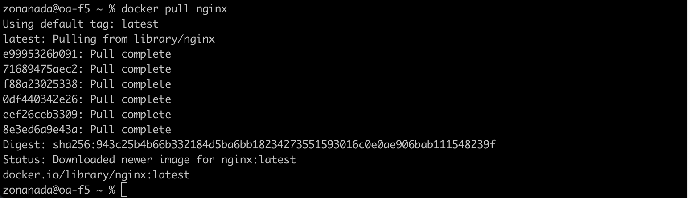
    
    Команда docker pull
- 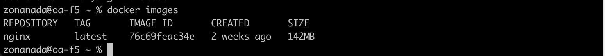
    
    Команда docker images
- 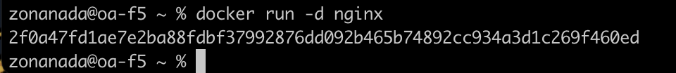
    
    Команда docker run
- 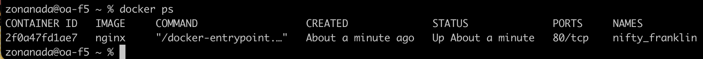
    
    Команда docker ps
- 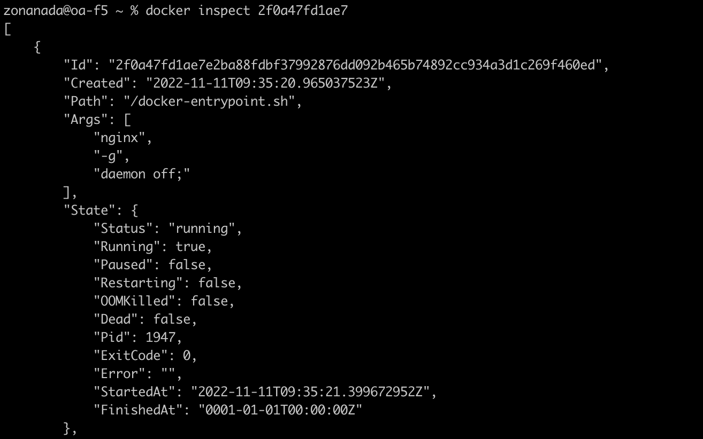
    
    Команда docker inspect

    Размер контенера: 64Mb

    Cписок замапленных портов: Null

    IP контейнера: 172.17.0.2

- 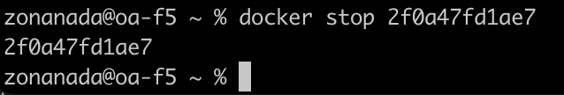
    
    Команда docker stop
- 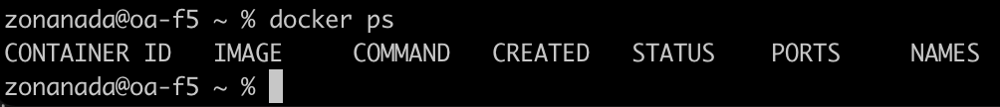
    Команда docker ps
- 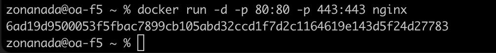
    
    Команда docker run -d с замапленными портами 
- 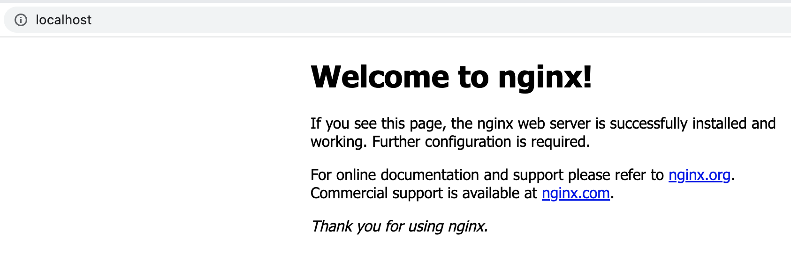
    
    Адресс в браузере https://localhost:80
- 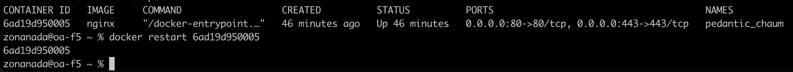
    
    Команда docker restart
- 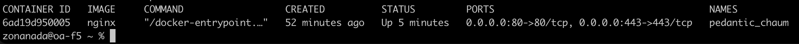
    
    Контейнер запустился

## Part 2
- 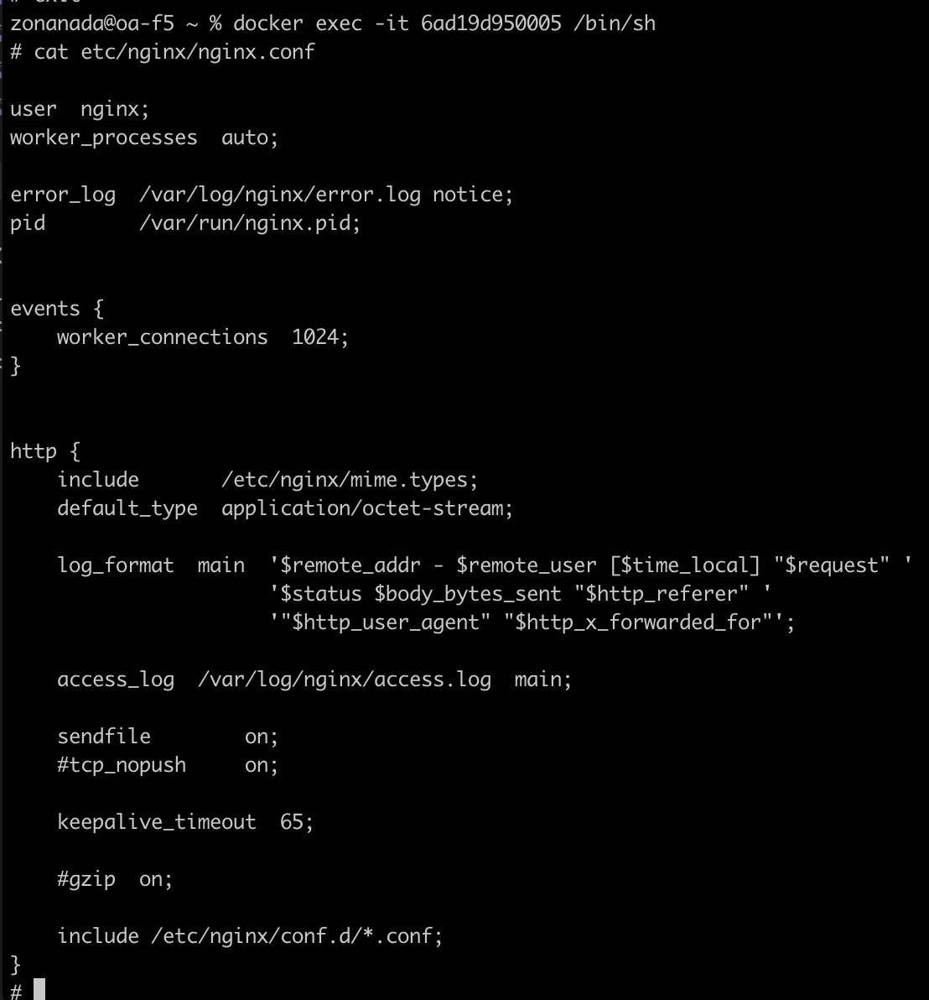
    
    Подключился к образу через docker exec. Открыл конфигурационный файл nginx.conf внутри докер контейнера.
- 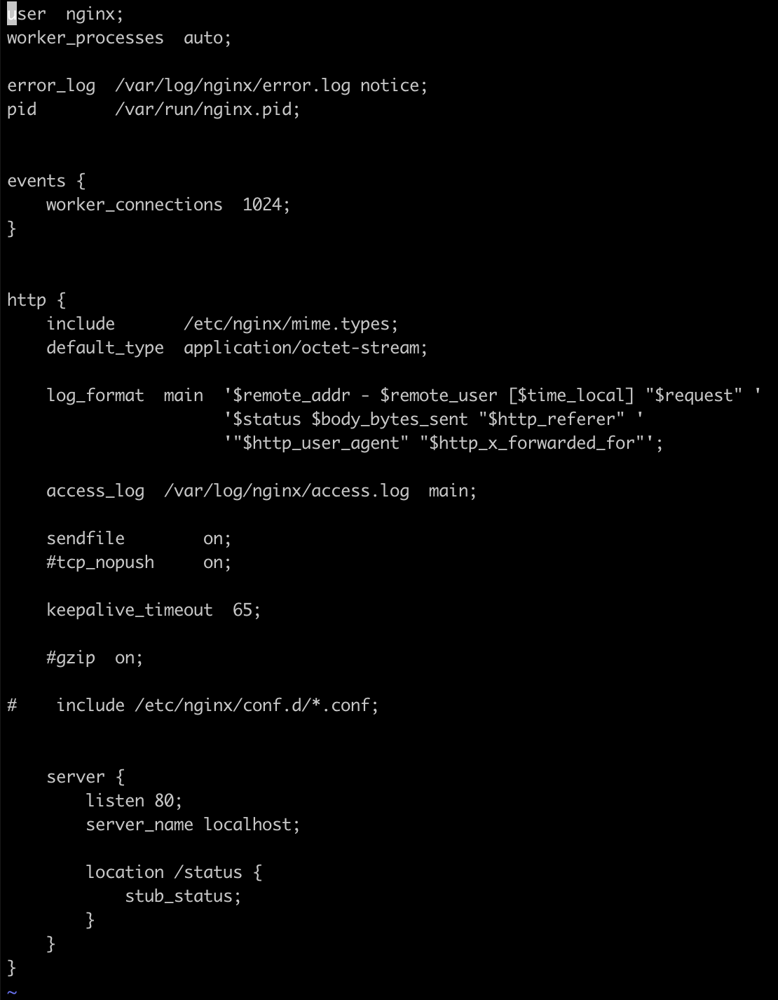
    
    Файл nginx.conf на локальной машине с настроенным путем /status
- 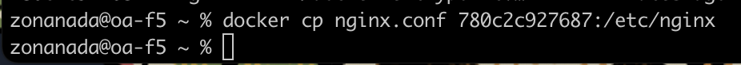
    
    Копирую созданный файл nginx.conf внутрь докер образа через команду docker cp
- 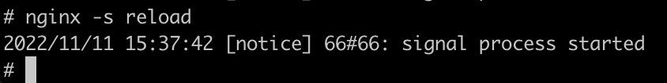
    
    Перезапустить nginx внутри докер образа
- 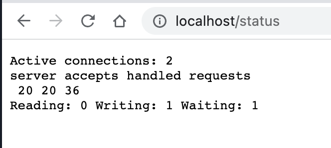

    По адресу localhost:80/status отдается страничка со статусом сервера nginx
- 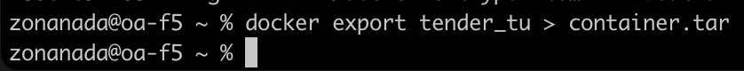
    
    Экспортировал контейнер в файл container.tar через команду export
- 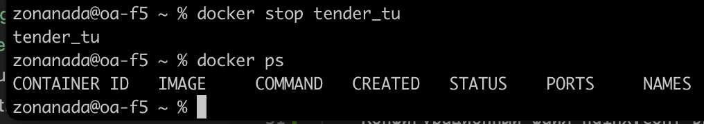
    
    Остановить контейнер
- 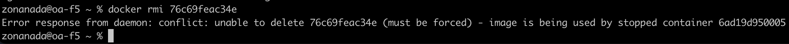
    
    Удалить образ через docker rmi. Образ нельзя не удаляя перед этим контейнеры.
- 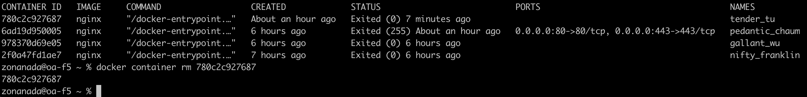
    
    Удалить остановленный контейнер
- 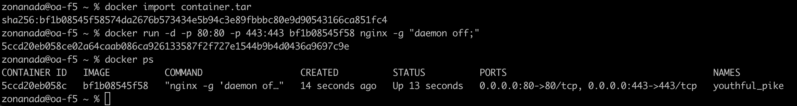
    
    Импортировал контейнер обратно через команду import и запустил
- 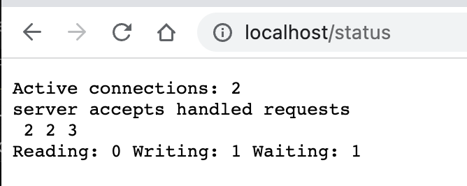
    
    роверил, что по адресу localhost:80/status отдается страничка со статусом сервера nginx

